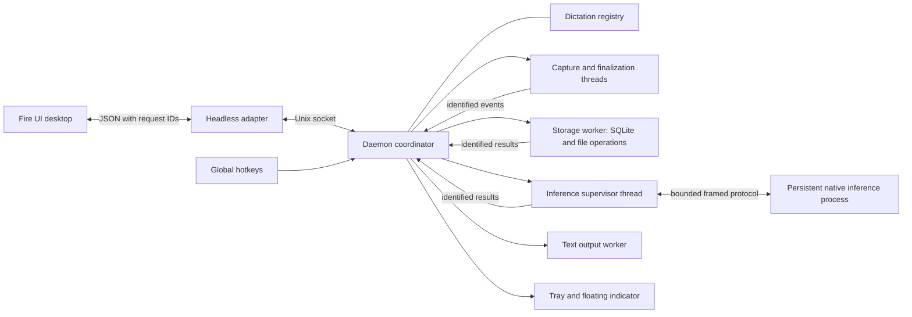

# Dictation architecture

The desktop and floating indicator render daemon state. The daemon is the sole
coordinator and the only autostarted application. Native model inference runs in
a persistent child supervised by a daemon worker thread. No native speech model
is loaded in the production daemon process.



## Ownership and lifecycle

`service/jobs.rs` owns job identities, legal stages and admission limits. Every
capture or history retry receives a monotonically increasing ID within a daemon
run. A job owns its configuration snapshot, cancellation token, history row,
capture handle and inference result. Pending/recording/output state is derived
from these jobs rather than manually incremented/decremented counters.

Captures advance through `starting`, `recording`, `finalizing`, `saving`,
`transcribing`, `persisting`, `ready` and `delivering`. History retries begin in
`resolving`, then join the transcription path. Terminal jobs are removed through
one completion function. Late inference results for removed IDs are ignored; late capture completions
are still saved and indexed. A job cannot
borrow another recording's history row or preview.

Inference can finish while capture is still active. Its result is held until
capture has stopped and audio has been saved. A capture failure retains the audio and its warning; startup failures before
a recorder exists end the job. Finalization and
persistence acknowledgements have distinct stages to prevent duplicate work.
Successful text is persisted before becoming eligible for output. Output waits
for recording release and follows admission order. Cancellation invalidates
pending jobs immediately; already-started text output is stopped through its cancellation token and remains
owned until its completion arrives. Keystrokes already emitted cannot be recalled.

## Responsive coordination

`service/daemon.rs` owns admission, lifecycle effects, startup and shutdown.
`service/events.rs` handles identified completions. `service/commands.rs` handles
user requests; `service/protocol.rs` validates command names and critical fields.
The existing protocol-2 JSON shape is preserved. Optional numeric `request_id`
values are echoed on direct and asynchronous replies; job events carry `job_id`.

Capture startup and finalization run outside the event loop. The spawning thread
stays alive until the recorder is reaped, preserving Linux parent-death semantics. A dedicated storage
worker owns the SQLite connection and performs history queries, audio copies,
configuration writes, diagnostics and maintenance. Client storage requests are
admission-limited, leaving internal job completions room to enqueue. Disk writes
can delay other storage operations, but cannot block cancellation or state
queries. A configuration change is applied to the coordinator only after its
save succeeds, and new conflicting work is rejected while a save is pending.

At most four jobs are admitted. Audio is chunked into at most 1,600 samples and
queued with a 256-chunk limit; overload stops capture and attempts to preserve
its audio rather than growing memory indefinitely. Levels and previews are
disposable. Terminal client delivery either succeeds or disconnects the slow
client, which reconnects and reads current state/history. The companion has a
replaceable latest-state mailbox, so meter traffic cannot drop its idle update.

## Inference supervision

`service/worker.rs` serializes model work. `service/inference.rs` owns the child
process and a private duplex Unix socket, with length-prefixed typed messages
limited to 2 MiB. The child's normal stdout is discarded; native stderr remains
in the service journal. One child keeps its model resident across streams and
batch retries. Model/profile changes replace the child.

The supervisor checks cancellation while waiting for replies. Model loading has
a ten-minute limit to accommodate first-time model downloads; each inference
operation has a two-minute limit. Socket writes have a 250 ms limit. Crashes,
protocol failures, timeouts and cancellations discard the affected child. The
next admitted job starts a new worker. Stopping the daemon also stops its native
child. The systemd unit uses `KillMode=mixed`: SIGTERM reaches the coordinator
first so it can drain capture/history; the ten-second deadline still kills any
remaining processes. Local updates install this setting as a unit drop-in. GPU initialization retains the existing CPU fallback behavior and reports
the actual loaded profile.

These boundaries contain native inference failures; they do not change model
accuracy or remove a decoder's generation limit.

## Persistence and diagnostics

User configuration remains at `~/.config/speech-to-text/config.yaml`. Existing
SQLite history and cached models are preserved. Finalized source audio is kept
until the durable recording and its history row have been written successfully.
A storage failure reports the recovery path. Retention is opt-in: both default
limits are zero. Explicit retention settings are applied on daemon startup by
the storage worker, preserving favorites and failing closed if history cannot
be read.

Lifecycle logs include PID, milliseconds, job ID, generation, stage, history row,
model and completion time. Child start/stop, full errors and thread panics are
logged. No transcript/audio content is added to lifecycle logs. Native engine
stderr and operating-system termination details remain available in the journal.

## Verification

The full repository gate covers Rust service/UI tests, Clippy, Python service
integration tests, a release build and native UI inspection. Fault tests cover
crash/restart, stalled-worker cancellation and timeout, stream/batch model reuse,
ordering, duplicate/stale results, remote ownership, cancellation before queued
persistence, failed destination writes, request correlation and shutdown.

Run the real model lifecycle probe with a cached GGUF path:

```sh
python3 tools/lifecycle_probe.py --binary /path/to/speech-service \
  --model /path/to/cached/parakeet.gguf --output artifacts/lifecycle-cpu
```

For a Vulkan build, add `--profile vulkan`. The probe creates its own daemon,
configuration, history and synthetic recorder. It kills only that daemon's
inference child, checks saved audio and next-job recovery, and reports state
request latency. It never opens the microphone or downloads a model.
